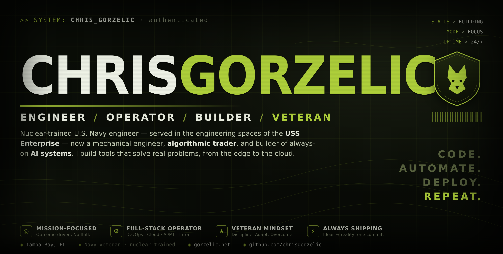

  

  
  
  
  

## `>` whoami

Nuclear-trained **U.S. Navy engineer** — served in the engineering spaces of the **USS Enterprise (CVN-65)** — now a mechanical engineer, **algorithmic trader**, and builder of always-on **AI systems**. I build tools that solve real-world problems and deliver results, from the edge to the cloud.

- ⚛️ &nbsp;**Hard engineering** — nuclear-grade discipline; systems built for where failure isn't an option.
- 📈 &nbsp;**Markets & quant** — multi-horizon, risk-forward; I build the tooling I trade on.
- 🤖 &nbsp;**AI & automation** — local-first agents that run real life. Private by design.
- 🎯 &nbsp;Outcome-driven. Veteran mindset. Always shipping.

## `>` featured projects

<table>
<tr>
<td width="50%" valign="top">

### 🤖 [Ziggy](https://meetziggy.ai)
An always-on personal agent that lives on your desktop — one command center for markets, research, and daily life, with a real voice, switchable personas, and a secure drag-and-drop vault. Private, local, modular.

**[meetziggy.ai](https://meetziggy.ai)** · [`meet-ziggy`](https://github.com/chrisgorzelic/meet-ziggy)

</td>
<td width="50%" valign="top">

### 🌍 [WorldLens](https://github.com/chrisgorzelic/worldlens)
A live, photoreal 3D globe of Earth's signals — earthquakes, weather, 1,700+ satellites, and trade flows — from free, keyless feeds. No API keys, no server.

[`worldlens`](https://github.com/chrisgorzelic/worldlens)

</td>
</tr>
<tr>
<td width="50%" valign="top">

### 📊 Financial Workstation · _private_
A quant trading command center — market data, signal, risk, and execution in one cockpit, paper-first with a hard risk envelope. In active development.

</td>
<td width="50%" valign="top">

### 🧠 Ziggy Brain / Shell · _private_
The local-first agent-OS under Ziggy — self-healing services, a knowledge brain, and a version-controlled owner's manual.

</td>
</tr>
</table>

## `>` tech stack

  
  
  
  
  

  
  
  
  
  

  
  
  
  
  

  
  
  
  
  

## `>` github

  
  

## `>` connect

- 🌐 &nbsp;**[gorzelic.net](https://gorzelic.net)**
- 📫 &nbsp;chris@gorzelic.net
- 📍 &nbsp;Tampa Bay, FL

&gt; <i>"The best way to predict the future is to build it."</i>

