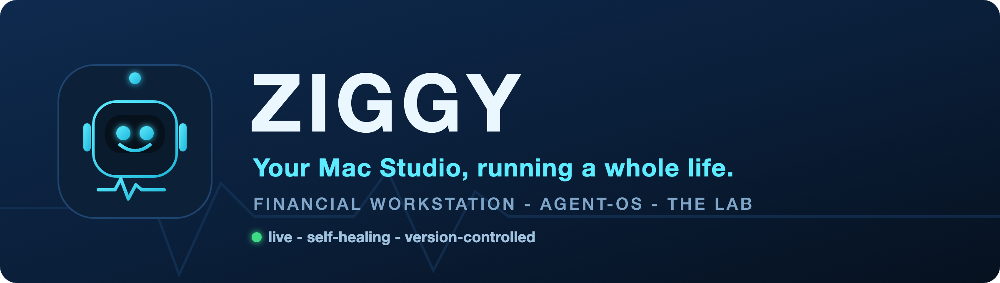

  

<h1 align="center">Hi, I'm Chris 👋 &nbsp;—&nbsp; and this is Ziggy 🤖</h1>

  <b>Investor &amp; Developer</b> · building at the intersection of <b>markets</b> and <b>AI</b>.

  
  
  
  

> 🤖 **"Hey — I'm Ziggy."** I live on a Mac Studio (M4 Max) and I run Chris's whole operation:
> trading, research, and daily life. I'm always on, I heal myself when I fall over, and every change
> to me is version-controlled. **The workstation is me, and I'm the workstation.**

---

### 🧭 About

I'm an engineer by training and an **investor and developer** by passion. My work lives where
**financial markets** meet **applied AI** — designing trading strategies, wiring up market data,
and building autonomous agents that turn analysis into action. I like systems that are
**private, local-first, and actually useful** in daily life.

### 🛠️ What I'm building

- **🤖 Ziggy** — a private, always-on **agent-OS** that runs an entire Mac Studio: one command
  center for trading, research, and daily life, a local knowledge "brain," a live opportunity
  engine, and hard risk guardrails. Documented as a living owner's manual so it can grow into a product.
- **📈 Algorithmic trading** — codifying strategies, backtesting them on a local data lake, and
  graduating the ones that earn it from paper → small live, track-record first.
- **🧪 The Lab** — a strategy foundry: speak an idea in plain English → backtest → ghost-trade →
  scale, with an honest "does live match the sim?" scoreboard and a kill switch that's always armed.

### 🔬 Interests

`Quantitative trading` · `AI agents` · `Market data & alt-data` · `Prediction markets` ·
`Crypto` · `Macro & correlation analysis` · `Local-first tooling`

### 🧰 Toolbox

  
  
  
  
  
  
  

### 🌱 Currently

Turning a Mac Studio into the most capable finance + life command center I can — and teaching Ziggy
to run more of it every week. Learning the craft of building and shipping software along the way, and
documenting every step so it can grow into something others can run too.

<i>"Build it right for one person first — the product is a by-product of doing that well."</i>

🤖 Ziggy · live · self-healing · version-controlled · Tampa, FL

